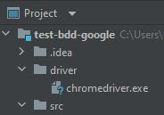

## test-bdd-google

Hallo :wave: Perkenalkan Nama Saya [Habiburrahman Ahmadi](https://www.instagram.com/habiburrahman21_/), biasa dipanggil Habib, Anda juga dapat menemukan saya di [Linkedin](https://id.linkedin.com/in/habiburrahman-ahmadi-750145159)

Kali ini saya akan membagikan tutorial Basic Test Automation menggunakan Selenium dengan Bahasa Pemrograman Java dan Framework Cucumber. Semoga bermanfaat :v:


<b> Tools yang dibutuhkan : </b>

<li> Java 11
<li> Intellij IDEA atau bisa menggunakan Eclipse
<li> Intellij IDEA Plugin : Cucumber for java
<li> Intellij IDEA Plugin : Gherkin
<li> Chromedriver (untuk web browser chrome) atau Geckodriver (untuk web browser firefox)
<li> Maven

<b> Adapun langkah-langkahnya berikut ini : </b>

1. Buat sebuah project pada IDE masing" , disini saya menggunakan Intellij IDE (https://www.jetbrains.com/idea/download/)


2. Install Plugin "Cucumber for java" & "Gherkin" (File-Settings-Plugins)


3. Buka file pom.xml dan tambahkan depency berikut ini 
```
//Ditambahkan setelah tag </properties>

<dependencies>

        <!-- https://mvnrepository.com/artifact/io.cucumber/cucumber-java -->
        <dependency>
            <groupId>io.cucumber</groupId>
            <artifactId>cucumber-java</artifactId>
            <version>6.9.0</version>
        </dependency>

        <!-- https://mvnrepository.com/artifact/junit/junit -->
        <dependency>
            <groupId>junit</groupId>
            <artifactId>junit</artifactId>
            <version>4.13.1</version>
            <scope>test</scope>
        </dependency>

        <!-- https://mvnrepository.com/artifact/io.cucumber/cucumber-junit -->
        <dependency>
            <groupId>io.cucumber</groupId>
            <artifactId>cucumber-junit</artifactId>
            <version>6.9.0</version>
            <scope>test</scope>
        </dependency>

        <!-- https://mvnrepository.com/artifact/org.seleniumhq.selenium/selenium-java -->
        <dependency>
            <groupId>org.seleniumhq.selenium</groupId>
            <artifactId>selenium-java</artifactId>
            <version>3.141.59</version>
        </dependency>

        <!-- https://mvnrepository.com/artifact/net.masterthought/cucumber-reporting -->
        <dependency>
            <groupId>net.masterthought</groupId>
            <artifactId>cucumber-reporting</artifactId>
            <version>5.4.0</version>
        </dependency>


    </dependencies>

    <build>
        <plugins>
            <plugin>
                <groupId>org.apache.maven.plugins</groupId>
                <artifactId>maven-surefire-plugin</artifactId>
                <version>2.22.0</version>
                <configuration>
                    <testFailureIgnore>true</testFailureIgnore>
                </configuration>
            </plugin>
            <plugin>
                <groupId>net.masterthought</groupId>
                <artifactId>maven-cucumber-reporting</artifactId>
                <version>2.8.0</version>
                <executions>
                    <execution>
                        <id>execution</id>
                        <phase>verify</phase>
                        <goals>
                            <goal>generate</goal>
                        </goals>
                        <configuration>
                            <projectName>test-bdd-google</projectName>
                            <outputDirectory>${project.build.directory}/cucumber-report-html</outputDirectory>
                            <cucumberOutput>${project.build.directory}/cucumber.json</cucumberOutput>
                        </configuration>
                    </execution>
                </executions>
            </plugin>
        </plugins>
    </build>
    
```
4. Tambahkan WebDriver (di tutorial ini saya menggunakan ChromeDriver extension dan bisa di download di ("https://chromedriver.chromium.org/downloads") lalu create directory pada project dan paste file chromedriver yang sudah didownload pada directory driver



5. Buat Directory "StepDef" dan "TestRunner" pada src/test/java dan juga buat Directory "Features" pada src/test/resources


6. Buat Feature file dengan nama "SearchGoogle.feature" pada directory Features
```
Feature: Search Google
  Scenario: I want to using feature search on google
    Given I Open browser
    And Open website Google
    And Located on google website
    When I search "Habiburrahman Ahmadi"
    Then Showing result related with "Habiburrahman Ahmadi"
```
7. Hover ke Gherkin scenarionya dan akan muncul action dan klik "More Action" lalu klik lagi "Create all step definitions" lalu buat nama class nya sesuai dengan nama Feature file dan klik "OK"


8.Otomatis tergenerate scenarionya seperti dibawah ini 


9. Isi script scenario di java code seperti dibawah ini 
```
import io.cucumber.java.en.And;
import io.cucumber.java.en.Given;
import io.cucumber.java.en.Then;
import io.cucumber.java.en.When;
import org.openqa.selenium.By;
import org.openqa.selenium.Keys;
import org.openqa.selenium.WebDriver;
import org.openqa.selenium.chrome.ChromeDriver;

public class SearchGoogle {
    WebDriver driver;
    @Given("I Open browser")
    public void iOpenBrowser() {
        final String dir = System.getProperty("user.dir");
        System.out.println("current dir = " + dir);
        System.setProperty("webdriver.chrome.driver", dir+"/driver/chromedriver.exe");
        driver = new ChromeDriver();
    }

    @And("Open website Google")
    public void openWebsiteGoogle() throws InterruptedException {
        driver.get("https://www.google.co.id/");
        Thread.sleep(1000);
    }

    @And("Located on google website")
    public void locatedOnGoogleWebsite() {
        driver.findElement(By.name("btnK")).isDisplayed();
    }

    @When("I search {string}")
    public void iSearch(String searchValue) {
        driver.findElement(By.name("q")).sendKeys(searchValue,Keys.ENTER);
    }

    @Then("Showing result related with {string}")
    public void showingResultRelatedWith(String result) {
        driver.findElement(By.xpath("//a[@href='https://id.linkedin.com/in/habiburrahman-ahmadi-750145159']")).isDisplayed();
        String urlLinkedinHabib = driver.findElement(By.xpath("//a[@href='https://id.linkedin.com/in/habiburrahman-ahmadi-750145159']")).getText();
        System.out.println(urlLinkedinHabib);
        driver.close();
        driver.quit();
    }
}
```

10. Kemudian untuk mencari elementnya bagaimana? buka google -> klik kanan -> inspect element -> arahkan pada elementnya. Seperti dibawah ini


11. Hover pada file feature dan klik run


12. Maka akan otomatis running test casenya , hasilnya akan seperti berikut : 


13. Buat java class "TestRunner" pada Directory TestRunner dan pindahkan SearchGoogle class ke dalam Directory StepDef


14. Lalu copy code berikut kedalam class TestRunner
```
@RunWith(Cucumber.class)
@CucumberOptions(features="src/test/resources/Features",
        glue= {"StepDef"},
        plugin ={"pretty","json:target/cucumber.json"})
```


15. Lalu open terminal pada IntelliJ dan ketik `mvn test` maka akan running test automation dan akan memunculkan result seperti ini


16. Lalu ketik `mvn verify -DskipTests` untuk generate report test yang sudah kita jalankan sebelumnya


17. Buka Directory target dan open file ini pada chrome


18. Maka hasil dari generate test tersebut adalah seperti ini : 


Selamat Mencoba , Semoga Berhasil :sunglasses:	


